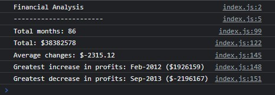

# Console Finances

## JavaScript Fundamentals

To write JavaScript code that analyzes the records to calculate each of the following:

* The total number of months included in the dataset.

* The net total amount of Profit/Losses over the entire period.

* The average of the **changes** in Profit/Losses over the entire period.
  * I will need to track what the total change in profits are from month to month and then find the average. (`Total/Number of months`)

* The greatest increase in profits (date and amount) over the entire period.

* The greatest decrease in profits (date and amount) over the entire period.

When open my code in the browser the resulting analysis should look like the following image and the final code should print the analysis to the console.

## Link to deployed application

https://soradaw.github.io/Console-Finances/

